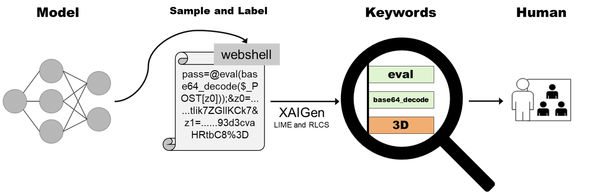
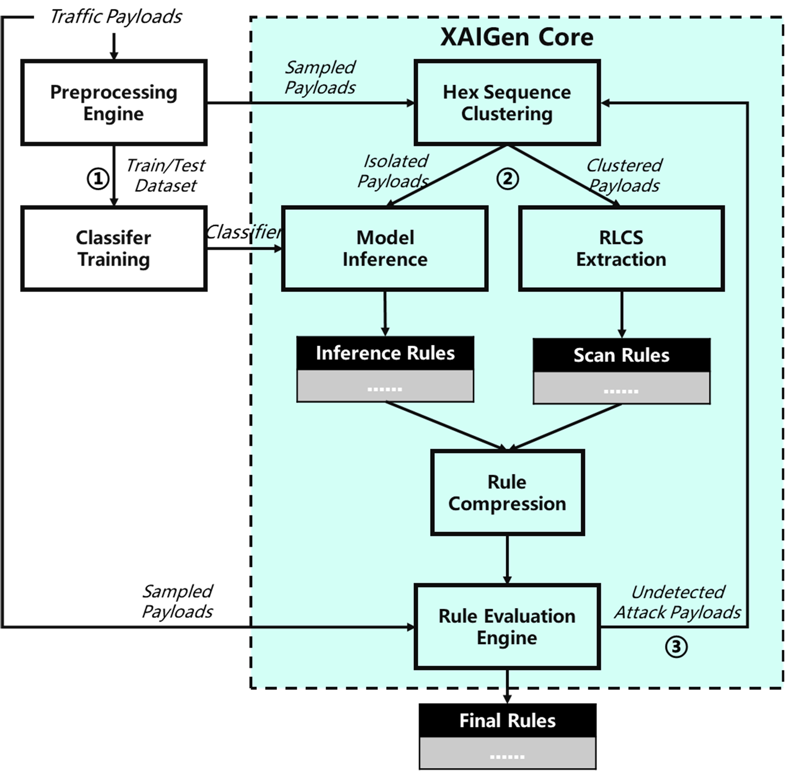

**XAIGen**
=
**Introduction**
-
This project is about extracting signature rules from malicious payloads and texts to help understand and strenthen predictions of machine learning black box models. XAIGen leverages both optimized sequence similarity based and black-box model inference based methods (such as [LIME](https://github.com/marcotcr/lime)) to extract patterns from homogeneous and heterogeneous text payloads respectively. Such rules can be applied to the detection on malicious intrusion, DDoS attack, sensitive data, spam email etc. XAIGen is able to improve the efficiency of rule extraction and free hands of security experts, improve the interpretable interaction ability of security operation products and platforms, and then enhance the level of automation.

**Installation**
-
XAIGen now support Python 3.6 and we suggest run it in your own virtual environments. The following commands are to prepare the execution environment.

git clone https://github.com/oasiszrz/XAIGen.git

pip install -r requirements.txt

**Test with Notebooks**
-
test-case-for-CSIC.ipynb and test-case-for-youtubespam.ipynb are test codes against CSIC and youtubespam datasets respectively, which are ready for running once the environments are deployed.

**Methodology & Workflows**
-
 
The system architecture and processing procedure are shown below. Datasets are preprocessed before input the core extraction procedure. Hex sequences are tokenized and non-ASCII characters are removed. The preprocessed procedure yield raw token set dataset with label 'malicious' or 'normal' (Currently XAIGen only support Binary Classification Problem). The malicious parts are sampled with predefined number parameter. These sampled malicious payloads are then fed into the core XAIGen process. Firstly, the tokenized payloads are clustered according to the payload hex sequences. DBScan clustering and paired-wise distance are used. Next, on the basis of the clustering results, two kinds of pattern extraction methods are deployed. The recursive LCS algorithm is applied on each clusters. On the other hands, the payloads out of any cluster are fed to the model-inference based pattern extraction module. As we cluster the payloads based on the hex sequences, samples located in any clusters are considered as similar payloads which are produced by malicious scan process or frequent operations. As a result, the captured rules are called 'scan rules'. On the other hand, other rules are called 'inference rules'. Next, both scan rules and inference rules are merged and compressed together. Finally, the compressed rules are evaluated and refined on the evaluation dataset. 
 

**Code Structure**
-
Codes are organized as below. 
├── data 
│   ├── CSIC (CSIC dataset and preprocessing procedure) 
│   └── youtube-spam (youtube spam dataset) 
├── doc (document related resources) 
├── LICENSE 
├── notebooks 
│   ├── test-case-for-CSIC.ipynb (Test on CSIC dataset) 
│   └── test-case-for-youtubespam.ipynb (Test on youtube spam dataset) 
├── README.md 
├── requirements.txt (pip install info) 
├── tpe_all_lcs.py (Recursive LCS) 
├── tpe.conf (Configurations) 
├── tpe_core.py (Core module for signature generation with clustering, XAI, RLCS and so on) 
├── tpe_distance_matrix.py (Compute the distance matrix for clustering) 
├── tpe_get_config.py (Read configerations) 
├── tpe_model.py (Generate test model for signature extraction) 
└── tpe_rule_validation.py (Rule evaluation and refining procedure) 
 

**TODO & Limitations**
-
1. Support more XAI based explanation methods (Now support lime.);
2. Support statistical feature based and raw hex based scenarios (Now support text-based.);
3. Support multi-class classification tasks (Now support binary classification.);
4. Support unsupervised tasks (Now support supervised.);
5. Support secure loading potential untrusted models from files (Modules like popular pickle are vulnerable to arbitrary code execution attacks. Now support integreted test model.);
6. Optimize preprocessing for security oriented data characteristics (Now suport raw texts.);
7. Optimize processing efficiency (Now support parallel optimization for model inference process.);
8. Optimize robustness and generalization capability of the rules;
9. ...

**Citation**
-
Runzi Zhang, Mingkai Tong, Lei Chen, et al. CMIRGen: Automatic Signature Generation Algorithm for Malicious Network Traffic. TrustCom 2020.

